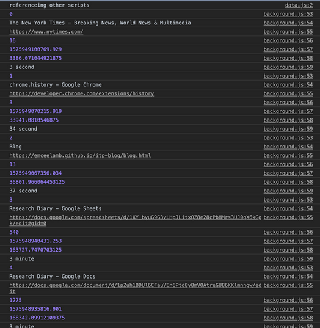
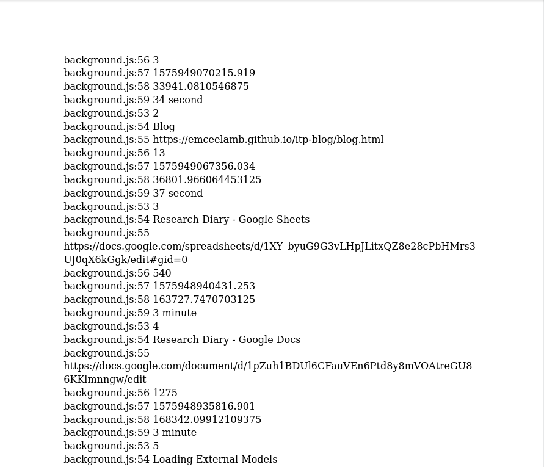
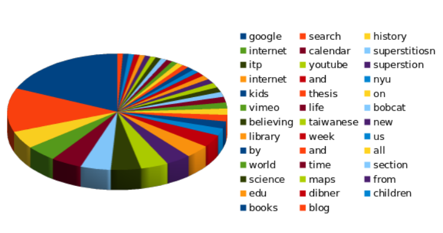

# User data analysis

Originally I wanted to continue working on my third project, Packet Compass, for the final project. I planned to build out a web component and add new features that would address data collection. The additional features would have included a real time tracerouting, a map that shows the location of the servers, and a lookup that would show the registrants of the servers and the names of the companies that owned the autonomous systems that the information traveled on. However NIME has completely taken over my time the past month and after the performance last Friday I was left little time to implement the features. I got as far as creating a web input that could run a trace route on the domains on user input, save it to a data base and lookup the network owners but because of CORS configurations, I felt it was still too rudimentary to present and not enough change from the previous iteration to discuss. At the last minute I shifted to work on a presentation that could better address the prompt and provide another approach to data culture than I have explored previously in class.

Having talked to Shuju about her project I knew that she was collecting her data and was planning on sharing it to the class. So I thought it could be an interesting study to try to analyze her data while taking on the persona of a data analyst for a data collection company. From a technical perspective it was a bit of a challenge. Shuju shared to me her raw data in a very dirty format, she literally copy pasted her console log into a google doc along with line numbers, extra html, and other garbage data. 

My first task was to clean it into something that I could use for analysis. This involved writing various python scripts to first clean the data and converting to JSON (see jsonifier.py & cleaner.py), a data type that I am more familiar workng with. Through this process I had to make decisions as a programmer about what data I wanted to keep and what data would be erased from my final output. It was only much later that I found out that I had deleted visit timestamps, both entry and exit of webpages. Had I known that these were part of the data set I would have kept it for analysis. 

After I got the data into a format that I could work with, I realized that I actually didn't know what to do with the data. Admittedly I don't have a background in either marketing or data science. So for this part I felt a little overwhelmed with the data because there didn't seem to be much to be learned from the data. So I did the obvious analyses: frequency count and categorizing.

For my output I wanted to lean into the critique of data culture by presenting my findings as if the class was a business and I was another busnessman. I went with using more traditional business methods for visualizing with the built in graph makers wth the spreadsheet program.

Ultimately I wanted to make my data critique through by usng all of the inappropriate use of data that we discussed in class:
- using inapprapriate data visualizing techniques 
- drawing conclusions on limited data
- selling products based on data 

What I learned in the process was how difficult it is to parse data, how data shows an incomplete picture of a person, and sympathy for the data analysts.

